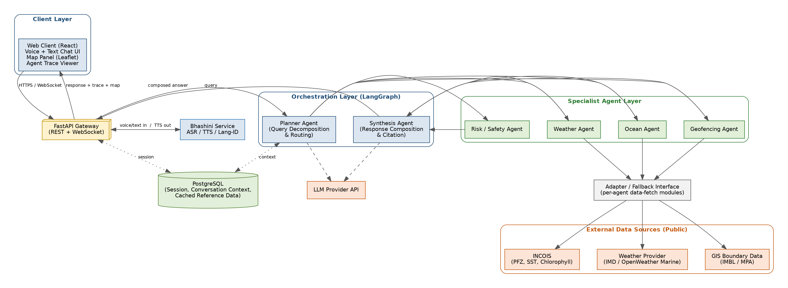
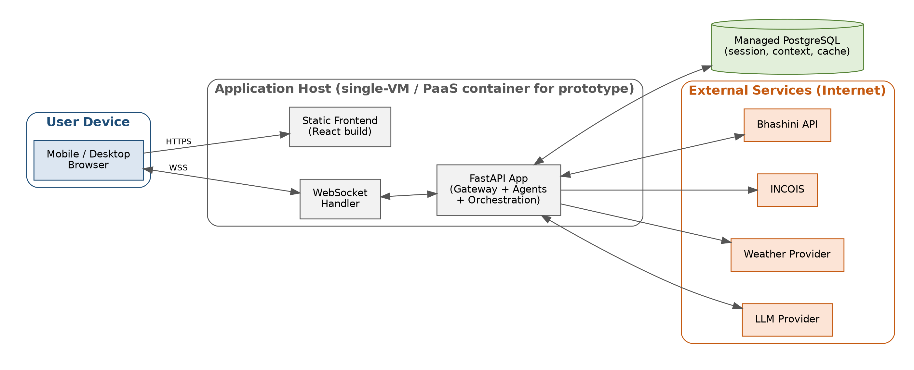

> **Readability mirror.** This file is generated from [`ORCA_HLD_v1.1.docx`](ORCA_HLD_v1.1.docx), which remains the authoritative, sign-off-bearing source document (SIH submission format). If this file and the .docx ever diverge, the .docx wins — regenerate this file after any .docx revision rather than hand-editing it out of sync.

---

# High-Level Design Document — ORCA

**Marine EcOsystem Reasoning with Collaborative Agents**
*An Agentic AI Marine Intelligence Platform*

| | |
|---|---|
| Problem Statement ID | SIH26176 |
| Organization | Indian Space Research Organisation (ISRO) |
| Theme | Disaster Management |
| Document Version | 1.1 |
| Reference | ORCA Software Requirements Specification v1.1 |
| Prepared by | Aditya Raj Arora |

## Document Control

### Revision History

| Version | Date | Author | Description of Change |
|---|---|---|---|
| 1.0 | 29 Aug 2026 | Aditya Raj Arora | Initial High-Level Design, developed against SRS v1.1 (9-day prototype timeline). |
| 1.1 | 01 Sep 2026 | Aditya Raj Arora | LLM provider changed from Claude/GPT to Google Gemini (Google AI Studio free tier) — no team member has a paid LLM subscription. Section 6 tech-stack table updated accordingly. |

### Purpose of This Document

This High-Level Design (HLD) document describes the system architecture, major components, data design, and interfaces for ORCA, translating the functional and non-functional requirements defined in the Software Requirements Specification (SRS v1.1) into a concrete technical design. It is the reference point for the Low-Level Design (LLD), which will specify internal module logic, class-level detail, and algorithms for each component introduced here.

## Table of Contents

(Right-click below and select "Update Field" in Microsoft Word to populate the table of contents.)

## 1. Introduction

### 1.1 Purpose

This document defines the high-level architecture of ORCA: its layered structure, major components, external interfaces, data design, and deployment model for the initial prototype. It is written for the development team executing the Sprint 0–4 plan defined in SRS v1.1, Section 6.5.

### 1.2 Scope

This HLD covers the architecture required to satisfy all functional requirements in SRS v1.1 Section 3 (FR-LANG, FR-PLAN, FR-WX, FR-OCEAN, FR-GEO, FR-RISK, FR-SYN, FR-UI, FR-ALERT) within the confirmed scope: four fully implemented specialist agents, full Bhashini multilingual support, and a live-API-only data strategy.

### 1.3 References

- ORCA Software Requirements Specification, Version 1.1 (29 August 2026).
- Smart India Hackathon 2026 — Problem Statement SIH26176.
- Bhashini API documentation — bhashini.gov.in.
- INCOIS Potential Fishing Zone advisory service — incois.gov.in.
## 2. Architectural Overview

### 2.1 Architectural Style

ORCA follows a layered, agent-oriented architecture. A single FastAPI backend hosts a LangGraph-based orchestration layer, within which specialist agents are implemented as independently invocable, independently testable units. This is not a distributed microservices deployment for the prototype phase (each agent is a Python module within one deployable application) — the architecture is nonetheless designed with clear module boundaries so that any agent could be extracted into its own service in a later phase without redesigning the orchestration contract (supporting NFR ‘Maintainability’, SRS Section 5.6).

### 2.2 High-Level Architecture Diagram

Figure 1: ORCA high-level architecture — client, language, orchestration, specialist agent, data access, and external layers.

### 2.3 Layer Descriptions

| Layer | Responsibility |
|---|---|
| Client Layer | Responsive React web client providing the conversational (voice/text) interface, map visualisation, and agent-trace display. |
| Language Layer | Wraps the Bhashini API for automatic speech recognition, text-to-speech, and language identification, decoupling the rest of the system from the specifics of the language-technology provider. |
| Orchestration Layer | Hosts the Planner Agent (query decomposition and routing) and Synthesis Agent (response composition and citation), implemented as a LangGraph state graph. |
| Specialist Agent Layer | Hosts the four domain agents (Weather, Ocean, Geofencing, Risk/Safety), each with a narrow, well-defined responsibility and a common invocation contract used by the Planner. |
| Data Access Layer | A thin adapter layer between specialist agents and external data providers, so that a provider change or an added fallback source requires modification only within this layer, not within agent logic. |
| External Data Sources | Public third-party services: INCOIS, a weather/marine data provider, and public GIS boundary datasets. |
| Persistence | PostgreSQL, storing session state, multi-turn conversation context, and any locally cached reference data (e.g. static GIS boundary geometry). |

## 3. Component Design

Each component below corresponds directly to one or more functional requirements in SRS v1.1, Section 3, enabling straightforward traceability (see Section 8).

| Component | Responsibility | Related Requirements |
|---|---|---|
| Web Client | Conversational UI (voice + text), interactive map (Leaflet), live agent-trace panel, multi-turn conversation display. | FR-UI-1 to FR-UI-4 |
| FastAPI Gateway | Single entry point for REST and WebSocket traffic; routes requests to the Language Layer and Orchestration Layer; manages session lifecycle. | Supports all FR groups |
| Bhashini Integration Module | Converts incoming speech to text, identifies query language, and converts outgoing text responses back to speech in the same language. | FR-LANG-1 to FR-LANG-6 |
| Planner Agent | Decomposes a query into sub-tasks, determines which specialist agent(s) to invoke and in what order, maintains multi-turn context. | FR-PLAN-1 to FR-PLAN-5 |
| Weather Agent | Retrieves current conditions, short-range forecasts, and active weather alerts for a location/time window. | FR-WX-1 to FR-WX-4 |
| Ocean Agent | Retrieves Potential Fishing Zone locations and oceanographic parameters (SST, chlorophyll); computes distance/direction to nearest PFZ. | FR-OCEAN-1 to FR-OCEAN-4 |
| Geofencing Agent | Checks a location against IMBL proximity and Marine Protected Area boundaries; raises unsuppressable alerts on violation. | FR-GEO-1 to FR-GEO-4 |
| Risk / Safety Agent | Combines Weather, Ocean, and Geofencing outputs into one composite, explainable safety verdict; defaults to conservative verdicts on missing data. | FR-RISK-1 to FR-RISK-3 |
| Synthesis Agent | Composes all invoked agents’ outputs into one coherent, cited natural-language response plus supporting visual evidence. | FR-SYN-1 to FR-SYN-3 |
| Data Access / Adapter Layer | Provides a uniform fetch interface per external data category; isolates specialist agents from provider-specific API details; the seam where a future fallback/cache source would be introduced. | Supports FR-WX, FR-OCEAN, FR-GEO; addresses SRS RISK-1 |
| Persistence (PostgreSQL) | Stores session records, conversation turns/context, and any cached static reference data (e.g. GIS boundary geometry). | Supports FR-PLAN-5, NFR-SEC-1 |

## 4. Data Design

### 4.1 Key Data Entities

| Entity | Key Attributes | Notes |
|---|---|---|
| Session | session_id, created_at, language, client_metadata | One per active user conversation; expires per NFR-SEC-1 voice-retention rule. |
| ConversationTurn | turn_id, session_id (FK), role (user/system), text, detected_language, timestamp | Enables multi-turn context (FR-PLAN-5); voice audio itself is not persisted beyond ASR transcription. |
| AgentInvocation | invocation_id, turn_id (FK), agent_name, input_payload, output_payload, data_timestamp, status | One row per specialist-agent call; powers the agent-trace UI (FR-UI-3) and the data-timestamp surfacing requirement (FR-WX-3). |
| GeofenceBoundary | boundary_id, type (IMBL / MPA), geometry, source, last_updated | Cached static/slow-changing GIS reference data, refreshed independently of live query traffic. |

### 4.2 Entity Relationships

- A Session has many ConversationTurns (one-to-many).
- A ConversationTurn has zero or more AgentInvocations (one-to-many) — zero when the Planner determines no specialist agent is required, more than one when multiple agents are invoked for a single query.
- GeofenceBoundary is independent reference data, queried by the Geofencing Agent but not owned by any Session or ConversationTurn.
### 4.3 End-to-End Data Flow (Illustrative Query)

The following walks through the data flow for the example query “Is it safe to fish near Kochi tomorrow morning?” spoken in Malayalam, referencing Figure 1.

| Step | Flow |
|---|---|
| 1 | Client captures voice input and streams it to the FastAPI Gateway over the WebSocket connection. |
| 2 | Gateway forwards the audio to the Bhashini Integration Module for ASR and language identification (detected: Malayalam). |
| 3 | The normalised text query, tagged with its detected language, is passed to the Planner Agent. |
| 4 | Planner Agent decomposes the query and determines that the Weather, Ocean, and Geofencing Agents are all relevant (location-linked safety query); it invokes each with the extracted location and time window. |
| 5 | Each specialist agent calls the Data Access Layer, which fetches live data from its respective external source (weather provider, INCOIS, GIS boundary data) and returns a structured, timestamped result. |
| 6 | The Risk / Safety Agent consumes the Weather, Ocean, and Geofencing outputs and produces a composite verdict with a supporting rationale. |
| 7 | All agent outputs are passed to the Synthesis Agent, which composes one coherent response, citing each contributing data source and timestamp. |
| 8 | The composed response is converted back to speech in Malayalam via the Bhashini Integration Module and streamed to the client alongside the map data and the agent-invocation trace. |
| 9 | The ConversationTurn and associated AgentInvocation records are persisted, enabling a coherent follow-up query (e.g. “what about the day after?”) in the same session. |

## 5. Interface Design

### 5.1 Internal API Contract (Gateway)

| Endpoint | Method / Protocol | Purpose |
|---|---|---|
| /api/v1/session | POST | Create a new conversation session; returns a session_id. |
| /ws/v1/query/{session_id} | WebSocket | Bidirectional channel for streaming voice/text queries and streaming responses (text, TTS audio, agent trace, map payload) within a session. |
| /api/v1/query/{session_id} | POST | Non-streaming fallback endpoint for a single text query, returning the full composed response synchronously. |
| /api/v1/session/{session_id}/history | GET | Retrieve prior conversation turns for the session (supports client-side conversation history display, FR-UI-4). |

### 5.2 External Interfaces (Summary)

Full detail is specified in SRS v1.1, Section 4.3. In summary: the Data Access Layer integrates with INCOIS (PFZ, SST, chlorophyll), a weather/marine data provider, and public GIS boundary datasets, each via REST or structured web-data retrieval; the Bhashini Integration Module integrates with the Bhashini REST API; the Planner and Synthesis Agents integrate with an LLM provider API for reasoning and natural-language generation.

## 6. Technology Stack

| Layer | Technology | Rationale |
|---|---|---|
| Frontend | React, Leaflet (maps), WebSocket client | Matches team’s existing skill set; Leaflet is lightweight and sufficient for marker/zone visualisation. |
| Backend / API | Python, FastAPI | Async-native, well-suited to orchestrating multiple concurrent external API calls per query. |
| Orchestration | LangGraph | Explicit state-graph model makes the Planner → Agents → Synthesis flow inspectable and directly supports the agent-trace requirement (FR-PLAN-4, FR-UI-3). |
| LLM | Google Gemini via Google AI Studio (function-calling / tool-use pattern) — free tier, no paid subscription required (v1.1 change, see Revision History) | Powers Planner decomposition and Synthesis composition. |
| Language Technology | Bhashini API | India’s national multilingual ASR/TTS/translation infrastructure; direct alignment with the problem statement’s named enabling technology. |
| Database | PostgreSQL | Relational integrity for session/turn/invocation relationships (Section 4.1–4.2); mature, well-understood by the team. |
| Geospatial | Public GIS boundary data + a lightweight geometry library (e.g. Shapely) for proximity checks | Sufficient for IMBL/MPA proximity computation without a full GIS server. |

## 7. Deployment Architecture

The prototype targets a single-application deployment suitable for the 9-day build window: one containerised FastAPI application (hosting the Gateway, Orchestration Layer, and all four Specialist Agents) alongside a managed PostgreSQL instance, with the React client built and served as static assets. This keeps operational overhead minimal during the prototype phase while preserving the internal module boundaries (Section 2.1, 3) needed to split services later if the project progresses beyond the prototype stage.

Figure 2: Prototype deployment view — single application host, managed database, external services over the internet.

### 7.1 Environment Notes

- A single environment (no separate staging tier) is assumed for the prototype phase, given the 9-day timeline; this should be revisited if the project continues past initial prototype delivery.
- All third-party API credentials (Bhashini, LLM provider) are managed as environment-level secrets per NFR-SEC-2 (SRS Section 5.4).
## 8. Traceability Matrix (Requirements → Design)

This matrix confirms that every functional requirement group in SRS v1.1 is addressed by at least one component defined in this HLD, closing the loop between requirements and design before Low-Level Design begins.

| SRS Requirement Group | HLD Component(s) |
|---|---|
| FR-LANG (Language Intake/Output) | Bhashini Integration Module (Section 3) |
| FR-PLAN (Planner Agent) | Planner Agent (Section 3); Orchestration Layer (Section 2.3) |
| FR-WX (Weather Agent) | Weather Agent + Data Access Layer (Section 3) |
| FR-OCEAN (Ocean Agent) | Ocean Agent + Data Access Layer (Section 3) |
| FR-GEO (Geofencing Agent) | Geofencing Agent + Data Access Layer + GeofenceBoundary entity (Section 3, 4.1) |
| FR-RISK (Risk/Safety Agent) | Risk / Safety Agent (Section 3) |
| FR-SYN (Synthesis Agent) | Synthesis Agent (Section 3) |
| FR-UI (User Interface) | Web Client (Section 3); AgentInvocation entity powering the trace view (Section 4.1) |
| FR-ALERT (Proactive Alerting) | Planner Agent + Risk/Safety Agent (extension point; not required for initial prototype exit criteria per SRS Section 6.5, Sprint 4) |

## 9. Design-Level Risk Carry-Over

The following design decisions directly address risks recorded in SRS v1.1, Section 6.3, and should be treated as binding for Low-Level Design:

- The Data Access Layer (Section 2.3, 3) is introduced specifically as a swappable-adapter seam, so that RISK-1 (live-only data dependency) can be mitigated later by adding a cache/fallback source without touching agent logic.
- Each Specialist Agent is designed with a common, narrow invocation contract (Section 3) so that RISK-3 (integration risk across four agents) is contained — each agent can be built and tested in isolation before Planner/Synthesis integration, per the Sprint 1/Sprint 2 split in SRS Section 6.5.
- The Bhashini Integration Module is isolated as its own layer (Section 2.3) specifically so that RISK-2 (multilingual integration surface) can be validated against 2–3 languages first and expanded later, without touching Planner, Synthesis, or any specialist agent.
## 10. Document Sign-off

This HLD forms the baseline for Low-Level Design. The LLD will specify, for each component in Section 3, internal class/module structure, function-level contracts, and algorithmic detail (e.g. the Risk/Safety Agent’s verdict-combination logic, the Planner Agent’s decomposition strategy).

| Role | Name | Signature / Date |
|---|---|---|
| Prepared by | Aditya Raj Arora |  |
| Reviewed by |  |  |
| Approved by (Faculty Mentor) |  |  |
