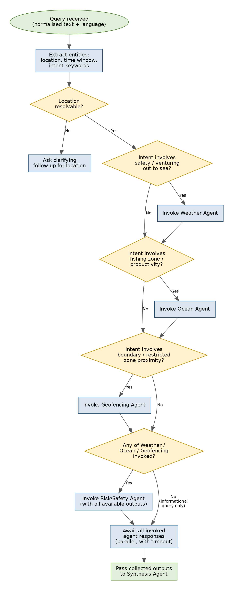
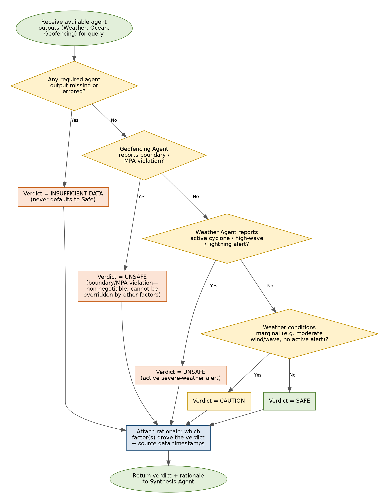

> **Readability mirror.** This file is generated from [`ORCA_LLD_v1.0.docx`](ORCA_LLD_v1.0.docx), which remains the authoritative, sign-off-bearing source document (SIH submission format). If this file and the .docx ever diverge, the .docx wins — regenerate this file after any .docx revision rather than hand-editing it out of sync.

---

# Low-Level Design Document — ORCA

**Marine EcOsystem Reasoning with Collaborative Agents**
*An Agentic AI Marine Intelligence Platform*

| | |
|---|---|
| Problem Statement ID | SIH26176 |
| Organization | Indian Space Research Organisation (ISRO) |
| Theme | Disaster Management |
| Document Version | 1.0 |
| Reference | ORCA SRS v1.1; ORCA HLD v1.0 |
| Prepared by | Aditya Raj Arora |

## Document Control

### Revision History

| Version | Date | Author | Description of Change |
|---|---|---|---|
| 1.0 | 29 Aug 2026 | Aditya Raj Arora | Initial Low-Level Design, developed against HLD v1.0. |

### Purpose of This Document

This Low-Level Design (LLD) specifies internal module structure, class/function-level contracts, algorithms, and database schema for each component defined in the ORCA High-Level Design (HLD v1.0). It is the direct reference for implementation during Sprints 1–4 (SRS v1.1, Section 6.5).

## Table of Contents

(Right-click below and select "Update Field" in Microsoft Word to populate the table of contents.)

## 1. Introduction

### 1.1 Purpose

This document translates each HLD component into implementable detail: class responsibilities, method signatures, request/response payloads, database DDL, and the two core decision algorithms (query decomposition and risk-verdict combination) that most directly determine correct system behaviour.

### 1.2 References

- ORCA Software Requirements Specification, Version 1.1.
- ORCA High-Level Design, Version 1.0.
## 2. Module-Level Design

### 2.1 Bhashini Integration Module

Implements FR-LANG-1 to FR-LANG-6

Wraps the Bhashini API to provide ASR, language identification, and TTS behind a single internal interface, isolating the rest of the system from Bhashini-specific request/response formats.

```python
class BhashiniClient:
    def transcribe(audio_bytes: bytes) -> TranscriptResult:
        """Returns transcript text + detected language code."""
 
    def synthesize(text: str, language: str) -> bytes:
        """Returns TTS audio bytes in the given language."""
 
    def detect_language(text: str) -> str:
        """Used when input is typed text rather than voice."""
 
@dataclass
class TranscriptResult:
    text: str
    language_code: str
    confidence: float
```

| Method | Description |
|---|---|
| transcribe() | Sends raw audio to Bhashini ASR endpoint; returns TranscriptResult. On failure, raises BhashiniUnavailableError, caught by the Gateway to trigger the FR-LANG-6 fallback message. |
| synthesize() | Sends final response text + target language to Bhashini TTS endpoint; returns playable audio bytes. |
| detect_language() | Used for typed-text queries where ASR is not involved; still required so FR-LANG-2 holds for both input modes. |

Design note: BhashiniClient is the only module permitted to import the Bhashini SDK/HTTP client directly (Data Access Layer principle, HLD Section 2.1) — no agent calls Bhashini directly.

### 2.2 Planner Agent

Implements FR-PLAN-1 to FR-PLAN-5

Decomposes a query into sub-tasks, determines which specialist agent(s) to invoke, and maintains multi-turn context. See Section 4.1 for the full decomposition algorithm and Figure 1 for its flowchart.

```python
class PlannerAgent:
    def plan(query: NormalizedQuery, context: ConversationContext) -> ExecutionPlan:
        """Returns ordered list of agent invocations to perform."""
 
    def extract_entities(query: NormalizedQuery) -> QueryEntities:
        """Extracts location, time window, and intent keywords."""
 
@dataclass
class ExecutionPlan:
    invocations: list[AgentInvocationRequest]
    trace: list[str]   # human-readable decisions, for FR-PLAN-4
```

| Method | Description |
|---|---|
| plan() | Core entry point; implements the decision tree in Section 4.1. Reads/updates ConversationContext so follow-up queries (FR-PLAN-5) resolve pronouns/omitted location against prior turns. |
| extract_entities() | Uses the LLM provider (function-calling) to extract structured entities from free-text query; low-confidence extractions trigger a clarifying question rather than a guess. |

### 2.3 Weather Agent

Implements FR-WX-1 to FR-WX-4

Retrieves current conditions, forecasts, and active alerts for a location/time window via the Data Access Layer.

```python
class WeatherAgent:
    def get_conditions(location: LatLon, window: TimeWindow) -> WeatherResult:
        """Returns wind, wave height, precipitation, visibility, and any active alerts."""
 
@dataclass
class WeatherResult:
    wind_speed_kmh: float
    wave_height_m: float
    active_alerts: list[str]
    data_timestamp: datetime
    status: Literal['ok', 'unavailable']
```

| Method | Description |
|---|---|
| get_conditions() | Delegates the actual HTTP call to WeatherDataAdapter (Section 2.9); on adapter failure, returns status='unavailable' rather than raising, per FR-WX-4. |

### 2.4 Ocean Agent

Implements FR-OCEAN-1 to FR-OCEAN-4

Retrieves Potential Fishing Zone and oceanographic data via the Data Access Layer, and computes proximity to the queried location.

```python
class OceanAgent:
    def get_nearest_pfz(location: LatLon) -> PFZResult:
        """Returns nearest PFZ centroid, distance_km, bearing_deg, and data age."""
 
    def get_ocean_parameters(location: LatLon) -> OceanParams:
        """Returns SST and chlorophyll concentration where published."""
 
@dataclass
class PFZResult:
    centroid: LatLon
    distance_km: float
    bearing_deg: float
    data_timestamp: datetime
    is_stale: bool   # FR-OCEAN-4
```

| Method | Description |
|---|---|
| get_nearest_pfz() | Uses the haversine formula (Section 4.3) against all currently published PFZ centroids to find the minimum-distance zone. |
| get_ocean_parameters() | Returns None fields (not fabricated values) for any parameter not published for the queried region. |

### 2.5 Geofencing Agent

Implements FR-GEO-1 to FR-GEO-4

Checks a location against IMBL proximity and MPA boundaries. This agent's output is treated as non-negotiable by the Risk/Safety Agent (see Figure 2 and Section 2.6).

```python
class GeofencingAgent:
    def check(location: LatLon) -> GeofenceResult:
        """Returns boundary/MPA violation status; never suppressed."""
 
@dataclass
class GeofenceResult:
    within_imbl_buffer: bool
    imbl_distance_km: float
    within_mpa: bool
    mpa_name: str | None
```

| Method | Description |
|---|---|
| check() | Uses a point-in-polygon test (Shapely) against cached GeofenceBoundary geometry (Section 3) for MPA checks, and a haversine distance against the IMBL polyline for the buffer check. Buffer threshold is a configurable constant (default 5 km), not hardcoded inline. |

### 2.6 Risk / Safety Agent

Implements FR-RISK-1 to FR-RISK-3

Combines Weather, Ocean, and Geofencing outputs into one composite, explainable verdict. See Section 4.2 for the full decision algorithm and Figure 2 for its flowchart.

```python
class RiskSafetyAgent:
    def evaluate(weather: WeatherResult | None,
                 geofence: GeofenceResult | None,
                 ocean: OceanResult | None) -> RiskVerdict:
        """Returns verdict + rationale. Never defaults to SAFE on missing data."""
 
@dataclass
class RiskVerdict:
    verdict: Literal['SAFE', 'CAUTION', 'UNSAFE', 'INSUFFICIENT_DATA']
    rationale: str
    contributing_factors: list[str]
```

| Method | Description |
|---|---|
| evaluate() | Pure function (no external I/O) implementing the decision tree in Figure 2. Deterministic and independently unit-testable against fixed input fixtures — critical given this is the safety-facing component. |

### 2.7 Synthesis Agent

Implements FR-SYN-1 to FR-SYN-3

Composes all invoked agents' outputs into one coherent, cited natural-language response.

```python
class SynthesisAgent:
    def compose(plan: ExecutionPlan,
                results: dict[str, AgentResult],
                language: str) -> ComposedResponse:
        """Returns final text, citations, and map/visual payload."""
 
@dataclass
class ComposedResponse:
    text: str
    citations: list[Citation]   # source + timestamp per claim
    map_payload: MapPayload
    trace: list[str]
```

| Method | Description |
|---|---|
| compose() | Uses the LLM provider to generate natural language constrained to only the facts present in `results`; a post-generation citation-coverage check (each sentence must map to a citation) rejects and regenerates any uncited claim before it reaches the user. |

### 2.8 FastAPI Gateway

Supports all FR groups; implements session/endpoint contracts from HLD Section 5.1

Single entry point for REST/WebSocket traffic; owns session lifecycle and routes normalized queries into the Orchestration Layer.

```python
@app.post('/api/v1/session')
def create_session() -> SessionResponse: ...
 
@app.websocket('/ws/v1/query/{session_id}')
async def query_socket(websocket: WebSocket, session_id: str): ...
 
@app.post('/api/v1/query/{session_id}')
def query_sync(session_id: str, body: QueryRequest) -> QueryResponse: ...
```

| Method | Description |
|---|---|
| create_session() | Creates a Session row (Section 3) and returns session_id to the client. |
| query_socket() | Streams ASR partials, the agent trace, and the final composed response back to the client over the same connection. |
| query_sync() | Non-streaming fallback for text-only queries (HLD Section 5.1). |

### 2.9 Data Access Layer (Adapters)

Supports FR-WX, FR-OCEAN, FR-GEO; directly addresses SRS RISK-1

One adapter per external data category, each behind a common interface so a provider swap or an added fallback source touches only this layer.

```python
class DataSourceAdapter(Protocol):
    def fetch(self, params: dict) -> AdapterResult: ...
 
class WeatherDataAdapter(DataSourceAdapter): ...
class INCOISAdapter(DataSourceAdapter): ...
class GISBoundaryAdapter(DataSourceAdapter): ...
 
@dataclass
class AdapterResult:
    data: dict | None
    fetched_at: datetime
    status: Literal['ok', 'unavailable', 'stale']
```

| Method | Description |
|---|---|
| fetch() | Every adapter implementation must return AdapterResult rather than raising on a data-unavailable condition, so agents can implement FR-WX-4 / FR-OCEAN-4 uniformly. |

Design note: this is the seam identified in HLD Section 9 for future fallback/cache insertion (RISK-1). Adding a cached-snapshot fallback later means adding a decorator around fetch(), not modifying any agent.

## 3. Database Schema

Schema for the four entities defined in HLD Section 4.1. All timestamps are stored in UTC; the client is responsible for localisation.

```python
CREATE TABLE session (
    session_id      UUID PRIMARY KEY DEFAULT gen_random_uuid(),
    created_at      TIMESTAMPTZ NOT NULL DEFAULT now(),
    language        VARCHAR(10),
    client_metadata JSONB
);
 
CREATE TABLE conversation_turn (
    turn_id           UUID PRIMARY KEY DEFAULT gen_random_uuid(),
    session_id        UUID NOT NULL REFERENCES session(session_id),
    role              VARCHAR(10) NOT NULL CHECK (role IN ('user','system')),
    text              TEXT NOT NULL,
    detected_language VARCHAR(10),
    created_at        TIMESTAMPTZ NOT NULL DEFAULT now()
);
 
CREATE TABLE agent_invocation (
    invocation_id  UUID PRIMARY KEY DEFAULT gen_random_uuid(),
    turn_id        UUID NOT NULL REFERENCES conversation_turn(turn_id),
    agent_name     VARCHAR(30) NOT NULL,
    input_payload  JSONB NOT NULL,
    output_payload JSONB,
    data_timestamp TIMESTAMPTZ,
    status         VARCHAR(15) NOT NULL DEFAULT 'pending',
    created_at     TIMESTAMPTZ NOT NULL DEFAULT now()
);
 
CREATE TABLE geofence_boundary (
    boundary_id  UUID PRIMARY KEY DEFAULT gen_random_uuid(),
    type         VARCHAR(10) NOT NULL CHECK (type IN ('IMBL','MPA')),
    name         VARCHAR(100),
    geometry     GEOMETRY(Geometry, 4326) NOT NULL,
    source       VARCHAR(100),
    last_updated TIMESTAMPTZ NOT NULL DEFAULT now()
);
 
CREATE INDEX idx_turn_session ON conversation_turn(session_id);
CREATE INDEX idx_invocation_turn ON agent_invocation(turn_id);
CREATE INDEX idx_boundary_geom ON geofence_boundary USING GIST (geometry);
```

Note: geofence_boundary uses PostGIS's GEOMETRY type with a GIST index for efficient point-in-polygon and distance queries (Section 2.5); this requires the PostGIS extension enabled on the PostgreSQL instance.

## 4. Core Algorithms

### 4.1 Planner Agent — Query Decomposition

The Planner uses a deterministic decision tree (not a free-form LLM decision) to determine which agents to invoke, so behaviour is predictable and testable. Entity extraction (location/time/intent keywords) uses the LLM; routing itself does not.



Figure 1: Planner Agent decomposition and routing logic.

### 4.2 Risk / Safety Agent — Verdict Combination

The verdict-combination logic is intentionally a plain decision tree rather than a learned model, so that the safety-critical output is fully explainable and auditable — directly satisfying FR-RISK-2 and the SRS's safety-first design principle.



Figure 2: Risk / Safety Agent verdict-combination logic. Geofencing violations and active severe-weather alerts are non-negotiable and cannot be downgraded by favourable data from other agents.

### 4.3 Ocean Agent — Nearest-PFZ Distance Calculation

Distance from the queried location to each published PFZ centroid is computed using the haversine formula, and the minimum is selected.

```python
def haversine_km(lat1, lon1, lat2, lon2) -> float:
    R = 6371.0  # Earth radius in km
    phi1, phi2 = radians(lat1), radians(lat2)
    d_phi = radians(lat2 - lat1)
    d_lambda = radians(lon2 - lon1)
    a = sin(d_phi/2)**2 + cos(phi1) * cos(phi2) * sin(d_lambda/2)**2
    return 2 * R * asin(sqrt(a))
 
def get_nearest_pfz(location, all_pfz_centroids):
    distances = [
        (pfz, haversine_km(location.lat, location.lon, pfz.lat, pfz.lon))
        for pfz in all_pfz_centroids
    ]
    nearest, dist_km = min(distances, key=lambda pair: pair[1])
    return PFZResult(centroid=nearest, distance_km=dist_km, ...)
```

## 5. Detailed API Design

### 5.1 POST /api/v1/session

Request: (empty body)

```python
Response 200:
{
  "session_id": "b3f1c2a4-...",
  "created_at": "2026-08-29T10:15:00Z"
}
```

### 5.2 WS /ws/v1/query/{session_id}

Client → Server message:

```json
{
  "type": "query",
  "mode": "voice" | "text",
  "audio_base64": "...",      // present if mode == voice
  "text": "...",              // present if mode == text
  "location_hint": {"lat": 9.93, "lon": 76.26}  // optional
}
```

Server → Client messages (streamed):

```json
{ "type": "trace_update", "step": "Planner: invoking Weather, Ocean, Geofencing" }
{ "type": "trace_update", "step": "Weather Agent: data received (t=2026-08-29T10:15:03Z)" }
{ "type": "final_response",
  "text": "...", "language": "ml",
  "audio_base64": "...",
  "verdict": "CAUTION",
  "citations": [ {"source": "INCOIS", "timestamp": "..."}, ... ],
  "map_payload": { "markers": [...], "zones": [...] } }
```

**Connection lifecycle.** One connection carries MANY query turns. The
server accepts the socket, then loops: read a `query`, stream that turn's
`trace_update` messages, send exactly one terminal message for it
(`final_response`, or `error`), and go straight back to waiting for the
next `query` on the same socket. The message shapes above are unchanged by
this — it governs how many turns a connection serves, not what is sent.

Two rules follow from it, both load-bearing:

- **A query-level failure must not close the connection.** A malformed
  payload or an unavailable language service (FR-LANG-6) is reported as an
  `error` message for that turn; the socket stays open and the next turn
  proceeds normally. Only a client disconnect ends the loop.
- **The server must be back in its receive state before the client can
  send again.** The client re-enables input the moment a terminal message
  arrives, so any window where the socket looks open to the browser but no
  one is reading it is a window where a query is silently swallowed.

The connection was originally one-query-per-connection, closed by the
server after each turn, with the client expected to reconnect. That is
**not** a valid implementation of this section and must not be
reintroduced: `close()` only *starts* a closing handshake, and when it does
not complete (observed in deployment behind a proxy — uvicorn logged
"connection open" many times and "connection closed" never), the browser
keeps `readyState === OPEN` and writes the next query into a socket the
handler has already returned from. The frame is lost with no error and no
reply, and the session appears to hang forever on the following turn.

### 5.3 POST /api/v1/query/{session_id}

Non-streaming equivalent of Section 5.2, for text-only clients; request and final response bodies follow the same schema as the WebSocket "query" and "final_response" messages above.

## 6. Error Handling and Resilience

| Condition | Handling |
|---|---|
| Bhashini API unreachable | Gateway catches BhashiniUnavailableError; returns a clear, user-visible error in the last-known-working language if available, else English (FR-LANG-6). |
| Weather / INCOIS / GIS adapter failure | Adapter returns AdapterResult(status='unavailable'); the owning agent returns a result with status='unavailable' rather than raising; Risk/Safety Agent treats this as "required agent output missing" (Figure 2) and returns INSUFFICIENT_DATA, never SAFE (NFR-REL-2). |
| LLM provider timeout during entity extraction | Planner falls back to a simpler keyword-matching extraction for intent classification; if location still cannot be resolved, asks the clarifying follow-up (Figure 1). |
| Partial agent timeout during a multi-agent query | Planner's "await all invoked agent responses" step (Figure 1) uses a bounded timeout per agent; a timed-out agent is treated identically to an errored one for Risk/Safety purposes. |

## 7. Traceability to HLD Components

| HLD Component | LLD Section |
|---|---|
| Bhashini Integration Module | 2.1 |
| Planner Agent | 2.2, 4.1 (Figure 1) |
| Weather Agent | 2.3 |
| Ocean Agent | 2.4, 4.3 |
| Geofencing Agent | 2.5 |
| Risk / Safety Agent | 2.6, 4.2 (Figure 2) |
| Synthesis Agent | 2.7 |
| FastAPI Gateway | 2.8, 5 |
| Data Access Layer | 2.9 |
| Persistence (PostgreSQL) | 3 |

## 8. Document Sign-off

This LLD is the direct implementation reference for Sprints 1–4 (SRS v1.1, Section 6.5). Any deviation discovered during implementation (e.g. a changed method signature) should be reflected back into this document to keep it accurate for testing and for the final project report.

| Role | Name | Signature / Date |
|---|---|---|
| Prepared by | Aditya Raj Arora |  |
| Reviewed by |  |  |
| Approved by (Faculty Mentor) |  |  |
